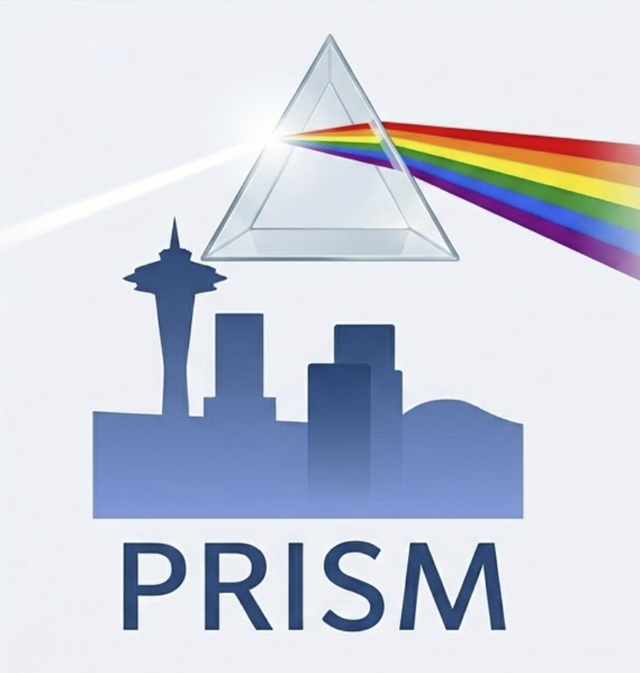

<p align="center">
  
</p>

# Skyline-PRISM

[](https://github.com/maccoss/skyline-prism/actions/workflows/dotnet-ci.yml)
[](https://github.com/maccoss/skyline-prism/releases/latest)
[](https://github.com/maccoss/skyline-prism/releases)
[](https://opensource.org/licenses/MIT)
[](https://dotnet.microsoft.com/)

**PRISM** normalizes transition-level LC-MS proteomics data exported from [Skyline](https://skyline.ms) and produces robust peptide- and
protein-level quantities. It uses Tukey median polish for outlier-tolerant rollups, retention-time-aware
normalization, and ComBat (optionally reference-anchored) batch correction, and reports reference/QC
sample CVs before and after each correction.

PRISM ships two ways to run the same pipeline:

- **`prism` CLI** — a cross-platform command-line tool (Windows, Linux, macOS).
- **Skyline external tool / PRISM GUI** — a Windows GUI that runs the pipeline and shows interactive QC
  plots. Launched from Skyline's Tools menu it drives the running document over JSON-RPC; it also runs
  **standalone** (no Skyline needed) on reports you already exported, and it can combine **several
  Skyline documents** — open or closed — into one multi-batch run.

> This repository also contains the original **Python** implementation, which remains the reference.
> See **[README-python.md](README-python.md)** for the `skyline-prism` PyPI package. The C# tools
> reproduce the Python pipeline's numeric results (exact parity on the deterministic stages).

## What it does

- **Robust rollups** — Tukey median polish (default) for transition→peptide and peptide→protein
  aggregation; automatically down-weights outliers without pre-filtering. Also sum, top-N, consensus,
  library-assisted (transition) and sum / top-N / maxLFQ / iBAQ (protein).
- **RT-aware normalization** — retention-time LOWESS normalization (default), plus median, quantile,
  VSN, or none.
- **Batch correction** — full empirical-Bayes ComBat, applied at the peptide and protein level; an
  opt-in reference-anchored variant estimates each batch's effect from inter-experiment reference
  samples across batches.
- **Protein parsimony** — indistinguishable-protein grouping, subset elimination, and shared-peptide
  handling (`all_groups`, `unique_only`, `razor`); mapping from Skyline's protein column or an
  enzyme-aware FASTA search (a peptide is attached to a protein only when its termini are consistent
  with the digestion enzyme, so it is not folded into homologs that merely share the subsequence).
- **Dual-control QC** — a self-contained HTML report with before/after intensity, PCA, and CV plots,
  a control-correlation heatmap, RT diagnostics, and a pass/fail validation banner.

Input peak areas are **linear**; the final `corrected_peptides` / `corrected_proteins` matrices are
written back in **linear** scale (all internal processing is on log2).

## Install

### Prerequisite: the .NET 8 runtime

Both the `prism` CLI and the Skyline external tool are **framework-dependent** — they share one
.NET 8 runtime that you install once (this keeps the downloads small). Install it before running
either tool:

| Platform | Install the .NET 8 runtime |
|---|---|
| **Windows** | `winget install Microsoft.DotNet.DesktopRuntime.8` — the **Desktop** Runtime covers both the CLI and the Skyline tool. |
| **macOS** | `brew install dotnet@8`, or the installer from the link below (Apple Silicon = arm64, Intel = x64). |
| **Linux** | Your distro package (e.g. `sudo apt install dotnet-runtime-8.0`) or the install script from the link below. |

All platforms and architectures — **x64 and ARM64** — are available at
<https://dotnet.microsoft.com/download/dotnet/8.0>. The CLI needs the base **.NET Runtime**; the
Skyline tool (WPF) needs the **.NET Desktop Runtime** on Windows, which is a superset — so installing
the Desktop Runtime covers both.

### CLI

Download the `prism` archive for your platform from the
[Releases](https://github.com/maccoss/skyline-prism/releases) page and put its folder on your `PATH`.
Available archives: `prism-win-x64.zip`, `prism-win-arm64.zip`, `prism-linux-x64.tar.gz`,
`prism-linux-arm64.tar.gz`, `prism-osx-x64.tar.gz`, `prism-osx-arm64.tar.gz`.

**Linux / WSL2** (use `prism-linux-arm64.tar.gz` on ARM, e.g. Graviton/Raspberry Pi)
```bash
curl -L https://github.com/maccoss/skyline-prism/releases/latest/download/prism-linux-x64.tar.gz | tar xz -C "$HOME/.local"
echo 'export PATH="$HOME/.local/prism-linux-x64:$PATH"' >> ~/.bashrc && source ~/.bashrc
prism --version
```
QC plots need the system font libraries: `sudo apt install libfontconfig1 libfreetype6`.

**Windows (PowerShell)** — download `prism-win-x64.zip` (or `prism-win-arm64.zip` on a
Windows-on-ARM PC) from Releases, then:
```powershell
Expand-Archive prism-win-x64.zip -DestinationPath $env:LOCALAPPDATA\Programs
# add  %LOCALAPPDATA%\Programs\prism-win-x64  to your PATH (System > Environment Variables)
prism --version
```

**macOS** — `prism-osx-arm64.tar.gz` (Apple Silicon) or `prism-osx-x64.tar.gz` (Intel):
```bash
curl -L https://github.com/maccoss/skyline-prism/releases/latest/download/prism-osx-arm64.tar.gz | tar xz -C "$HOME/.local"
echo 'export PATH="$HOME/.local/prism-osx-arm64:$PATH"' >> ~/.zshrc && source ~/.zshrc
xattr -dr com.apple.quarantine "$HOME/.local/prism-osx-arm64"   # if Gatekeeper blocks the unsigned binary
prism --version
```

**Build from source** instead (requires the [.NET 8 SDK](https://dotnet.microsoft.com/download)):
```bash
git clone https://github.com/maccoss/skyline-prism
cd skyline-prism/dotnet
dotnet build SkylinePrism.CrossPlatform.slnf -c Release
# the CLI is src/SkylinePrism.Cli/bin/Release/net8.0/prism(.exe)
```

### Skyline external tool (Windows)

Install the **.NET 8 Desktop Runtime** (see the prerequisite above —
`winget install Microsoft.DotNet.DesktopRuntime.8`), then download `SkylinePrism.zip` from
[Releases](https://github.com/maccoss/skyline-prism/releases) (or build it — see below) and install
it in Skyline via **Tools → Tool Store → Install from file**. The tool appears under the Tools menu
and connects to the running document.

On the **Inputs** tab you add one input per batch and PRISM runs them as a single cohort, so a study
split across several Skyline documents does not need each report exported by hand:

- **Add open document** — any running Skyline instance (exported over the live connection, as parquet).
- **Add Skyline document (.sky)** — a document that is *not* open; PRISM exports it in the background
  with `SkylineCmd.exe`, which it finds from your Skyline installation (invariant CSV — Skyline's
  command line has no parquet writer). The document is opened read-only and never saved.
- **Add exported report** — a `.parquet`/`.csv`/`.tsv` PRISM report you already have.

Each input carries an editable **Batch label** (the document name by default) that becomes its batch in
the merged data, which keeps identically named reference/QC injections from different plates distinct.

Double-clicking the installed `SkylinePrism.exe` opens the same window in **standalone mode** — a plain
PRISM GUI with no Skyline running. See [dotnet/README.md](dotnet/README.md) for details.

**[docs/skyline-tool.md](docs/skyline-tool.md)** covers what the window does once a run finishes: the
Dynamic Range and Spectrum density plots, protein lists, two-way selection with the document tree,
stopping a run, and the environment variables.

## Quick start (CLI)

```bash
# 1. Generate a configuration template and edit it to taste
prism config-template -o config.yaml

# 2. Run the full pipeline on one or more Skyline transition reports
prism run -i report.csv -o output/ -c config.yaml

# ...or merge several plates, with a Replicates metadata report
prism run -i plate1.csv plate2.csv -o output/ -c config.yaml -m replicates.csv
```

`prism run` writes the corrected matrices, intermediate parquet, protein groups, provenance, and a QC
report to the output directory (see [Output](#output)). Run `prism --help` or `prism <command> --help`
for details.

### Commands

| Command | Purpose |
|---|---|
| `prism run` | Run the full pipeline (rollup → normalize → batch-correct → QC) |
| `prism merge` | Merge Skyline transition reports into one sorted parquet |
| `prism qc` | (Re)generate `qc_report.html` from an existing output directory |
| `prism compare` | Compare control-sample CVs between two runs |
| `prism config-template` | Emit an annotated configuration template (`--minimal` for common options) |

## Pipeline

```
Merge reports  →  Transition→Peptide rollup  →  Peptide normalization  →  Peptide ComBat
                                                                                │
                                            ┌───────────────────────────────────┤
                                            ▼                                   ▼
                              Protein parsimony + rollup                 corrected_peptides
                                            │
                              Protein normalization  →  Protein ComBat  →  corrected_proteins  →  QC report
```

Batch correction is applied at the reporting level (peptide and protein), not before rollup. RT-LOWESS
normalization and reference sample handling are learned from control samples only.

## Configuration

`prism config-template` emits a commented YAML file with every option and its default. Key sections:

```yaml
transition_rollup:    # sum | median_polish (default) | topn | consensus | library_assist
global_normalization: # rt_lowess (default) | median | quantile | vsn | none
batch_correction:     # ComBat; peptide/protein levels; reference_anchored: true|false
parsimony:            # fasta_path; shared_peptide_handling; enzyme (default trypsin) + enzyme_specificity
protein_rollup:       # median_polish (default) | sum | topn | maxlfq | ibaq
qc_report:            # HTML report + plots
```

See **[docs/parameters.md](docs/parameters.md)** for the full parameter reference — every key, its
default, and whether it is available in the Python package, the C# port, or both.

A run records its full configuration to `parameters.json`; `prism run --from-provenance
out/parameters.json` reproduces an earlier run's settings.

## Output

| File | Scale | Contents |
|---|---|---|
| `corrected_peptides.parquet` | linear | Normalized, batch-corrected peptide quantities |
| `corrected_proteins.parquet` | linear | Normalized, batch-corrected protein quantities |
| `peptides_rollup.parquet` | log2 | Raw peptide abundances from the transition rollup |
| `proteins_raw.parquet` | log2 | Raw protein abundances from the peptide rollup |
| `protein_groups.csv` | — | Protein group / parsimony assignments |
| `sample_metadata.csv` | — | Resolved sample types and batches |
| `parameters.json` | — | Full run configuration (provenance) |
| `qc_report.html` + `qc_plots/` | — | QC report and diagnostic plots |

## Build the Skyline external tool

```bash
dotnet msbuild dotnet/build/package.proj /p:Configuration=Release
# -> dotnet/publish/SkylinePrism.zip  (SkylinePrism.exe + tool-inf/ + runtime DLLs)
```

## Documentation

- **[dotnet/README.md](dotnet/README.md)** — building, testing, project layout, and CI for the C# code.
- **[SPECIFICATION.md](SPECIFICATION.md)** — the authoritative algorithm/format specification.
- **[docs/](docs/)** — [the Skyline tool](docs/skyline-tool.md), [parameters](docs/parameters.md), [methods](docs/methods.md), [output files](docs/output_files.md), [protein parsimony](docs/parsimony.md), and [building a Skyline external tool](https://github.com/uw-maccosslab/skyline-external-tools-ai) (its own repo now).
- **[README-python.md](README-python.md)** — the original Python `skyline-prism` package.

## License

MIT — see [LICENSE](LICENSE). Skyline is an external tool (<https://skyline.ms>); PRISM processes its
exports and does not modify Skyline.
